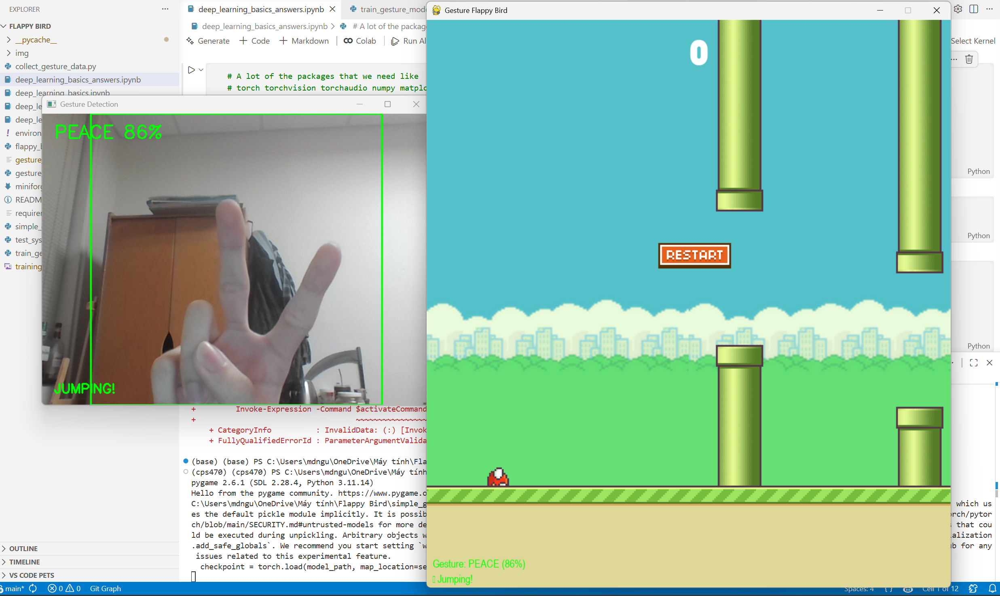

# Flappy Bird with Gesture Control

This repository demonstrates the fundamentals of deep learning by building a gesture recognition system that controls a Flappy Bird game. The project walks through the complete machine learning pipeline: environment setup, data collection, model training, and real-world application.



## Project Purpose

Learn the basics of deep learning by:
- Understanding convolutional neural networks (CNNs)
- Collecting and preparing training data
- Training a computer vision model
- Deploying the model in a real-time application

The end result is a Flappy Bird game controlled by hand gestures captured through your webcam.

## Prerequisites

- A computer with a webcam
- Basic Python knowledge
- Windows, macOS, or Linux

## Setup Instructions

### 1. Install Miniforge

Follow the installation guide in [miniforge-install-guide.md](miniforge-install-guide.md) to set up your Python environment with Miniforge.

### 2. Create the Environment

Create and activate the conda environment with all required dependencies:

```bash
conda env create -f environment.yml
conda activate flappy
```

### 3. Verify Installation

Run the system test to ensure all dependencies are properly installed:

```bash
python test_system.py
```

This will verify that PyTorch, OpenCV, and other required libraries are working correctly.

## Training the Gesture Model

### Step 1: Collect Training Data

Run the data collection script to capture images of your hand gestures:

```bash
python collect_gesture_data.py
```

Instructions:
- Press **0** then make a **fist** gesture to capture training images for class 0
- Press **1** then make a **peace sign** gesture to capture training images for class 1
- Capture multiple images from different angles and lighting conditions for better accuracy
- Press **q** to quit when you have enough samples (aim for at least 100-200 images per gesture)

### Step 2: Train the Model

Train the CNN model on your collected gesture data:

```bash
python train_gesture_model.py
```

This will train a convolutional neural network to recognize your gestures and save the trained model as `gesture_model.pth`.

## Running the Game

Once the model is trained, launch the gesture-controlled Flappy Bird game:

```bash
python simple_gesture_flappy.py
```

Game controls:
- Hold a **peace sign** to make the bird jump continuously
- Show a **fist** or release to let the bird fall
- Try to navigate through the pipes by controlling the bird's height with your gestures

## Learning Materials

The repository includes Jupyter notebooks that explain deep learning concepts:

- `deep_learning_basics.ipynb` - Introduction to neural networks and PyTorch
- `deep_learning_train_cnn.ipynb` - Training convolutional neural networks

These notebooks provide additional context and exercises for understanding the underlying theory.

## Project Structure

- `collect_gesture_data.py` - Script for capturing training images
- `train_gesture_model.py` - Model training script
- `gesture_model.py` - CNN architecture definition
- `simple_gesture_flappy.py` - Gesture-controlled Flappy Bird game
- `flappy_bird.py` - Standard Flappy Bird implementation
- `test_system.py` - System verification script
- `environment.yml` - Conda environment configuration
- `requirements.txt` - Python package dependencies
